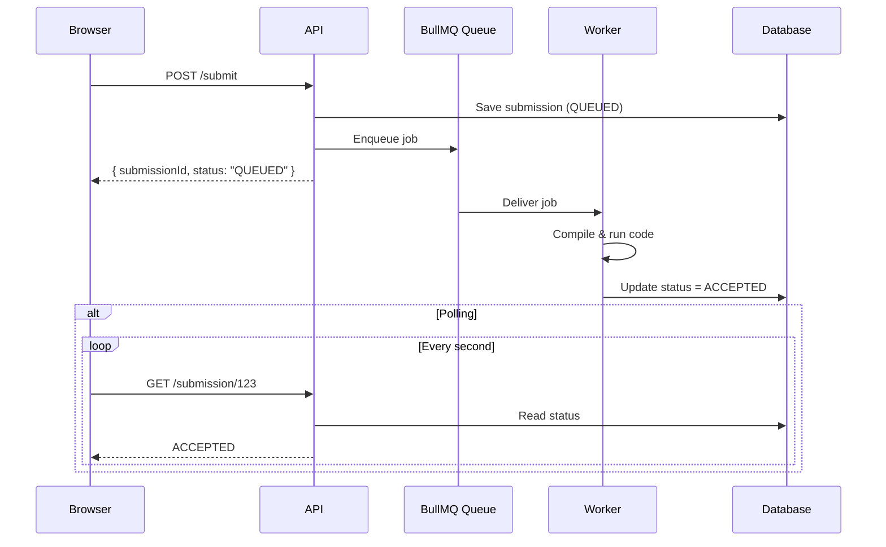

# Execution Engine

A secure and scalable backend service that enables users to submit source code, execute it in isolated environments, and receive execution results such as output, errors, and resource usage.

---

### Execution Flow

