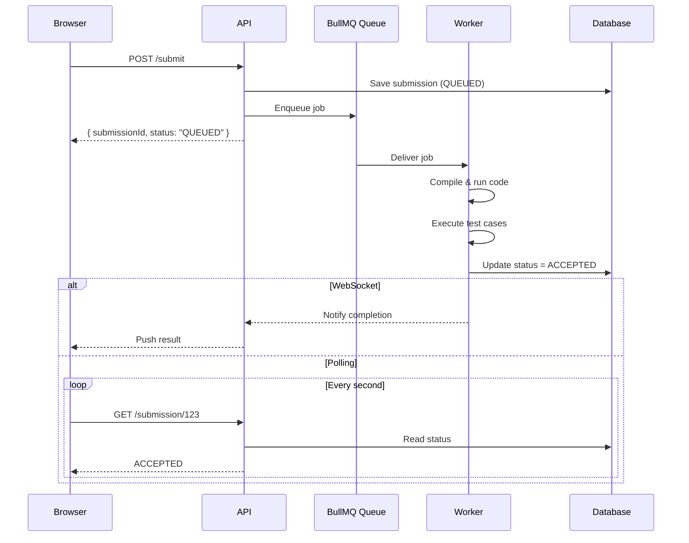

# Execution Engine

**Note:** One gap to watch: if you didn't implement actual sandboxing (e.g., you're just running exec() in a subprocess without isolation), that's a security hole an interviewer might probe — be ready to speak to how you'd harden it even if the current version is simplified.

*Note:* Until development is done I won't be concerned with how deployment is gonnna look like.

## System Architecture

1. For simplicity I won't be using cloud compute. All execution will happen on a single machine, using Docker.
2. Docker should contain
   - API Container
   - Code Execution Container
   - Redis Container
   - Postgres Container
   - Docker Daemon

---

### Execution Flow

