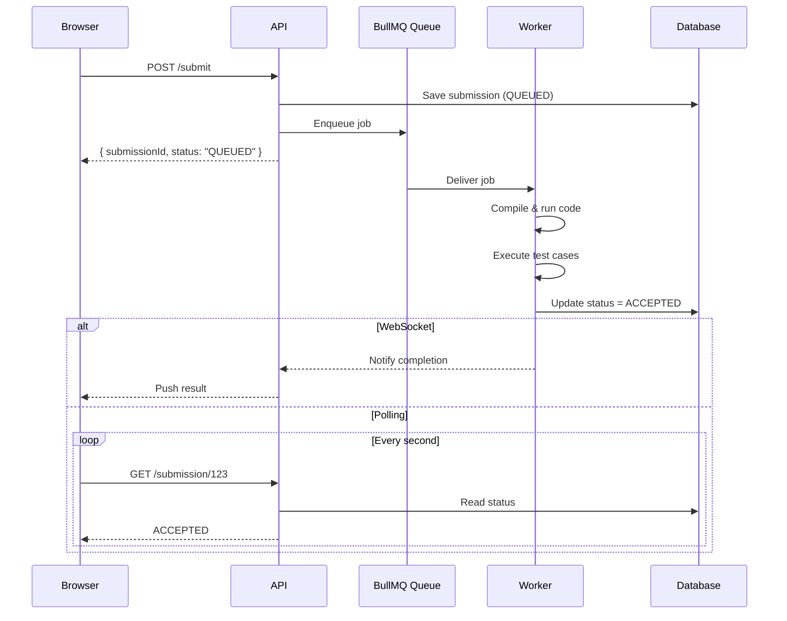

# Execution Engine

## System Architecture

### Execution Flow

```mermaid
sequenceDiagram
    participant Browser
    participant API
    participant Queue as BullMQ Queue
    participant Worker
    participant DB as Database

    Browser->>API: POST /submit
    API->>DB: Save submission (QUEUED)
    API->>Queue: Enqueue job
    API-->>Browser: { submissionId, status: "QUEUED" }

    Queue->>Worker: Deliver job
    Worker->>Worker: Compile & run code
    Worker->>Worker: Execute test cases
    Worker->>DB: Update status = ACCEPTED

    alt WebSocket
        Worker-->>API: Notify completion
        API-->>Browser: Push result
    else Polling
        loop Every second
            Browser->>API: GET /submission/123
            API->>DB: Read status
            API-->>Browser: ACCEPTED
        end
    end
```
